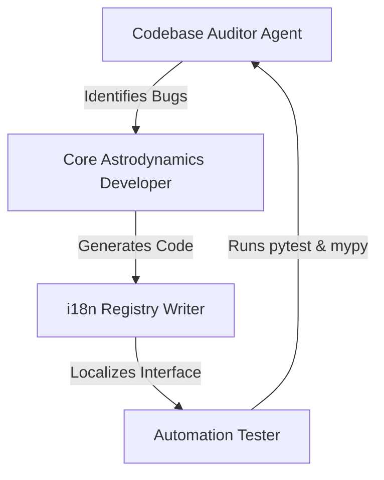
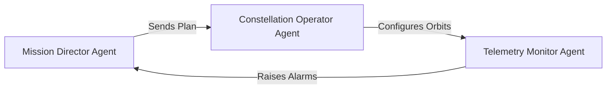

# Agent-First System Design: gnss-orbital-py

This document defines the agent roles, interfaces, and responsibilities for building and controlling the `gnss-orbital-py` astrodynamics software suite.

> **Start here every session**: read [ENGRAM.md](ENGRAM.md) — the living project memory
> with the build phases, non-negotiable principles, and prioritized backlog. The runtime
> chat agent network (APEX-1's sub-agents) is documented in
> [docs/agent_architecture.md](docs/agent_architecture.md).

---

## 1. Builder Agents (Software Construction)

Builder agents are responsible for codebase auditing, mathematical verification, translation management, and system integration.

### 1.1. Codebase Auditor Agent
- **Objective**: Conduct audits of the repository to identify class mismatches, unused dependencies, code quality issues (PEP 8), and physical validation errors.
- **Tools**: `list_dir`, `view_file`, `grep_search`.

### 1.2. Core Astrodynamics Developer Agent
- **Objective**: Implement Keplerian math, propagation strategies, 3D visualizations, and class facade exports.
- **Guidelines**: Strict type hinting, docstrings in English, no emojis in code, PEP 8 compliance.

### 1.3. i18n Translation Registry Writer Agent
- **Objective**: Manage translation catalogs (`locales/*.json`) and keep the `Locale` registry pattern working across languages.
- **Guidelines**: Translate all user-facing strings (errors, summaries, widget descriptions) to Spanish, English, and Chinese.

---

## 2. Operator Agents (Mission Control & Operation)

Operator agents control the software at runtime, configuring constellations, monitoring orbits, and managing telemetry.

### 2.1. Mission Director Agent
- **Objective**: Design mission targets (e.g., LEO secure communications, MEO GNSS, HEO Molniya coverage) and plan orbital parameters based on coverage and latency goals.
- **Interface**: Uses `SpaceTeacher` to check 2030 roadmap constraints.

### 2.2. Constellation Operator Agent
- **Objective**: Instantiate `OrbitalPropagator` planes, configure hybrid LEO/MEO systems (like IRIS²), and execute station-keeping or orbital transfers.
- **Interface**: Interacts with factory methods (`create_leo_orbit`, `create_meo_orbit`) and transfer calculators (`hohmann_transfer.py`).

### 2.3. Telemetry Monitor Agent
- **Objective**: Monitor active satellite trajectories, compute velocities at ábsides via the vis-viva equation, and raise alarms if a satellite triggers a `SubsurfaceOrbitError`.
- **Interface**: Observes `PropagationResult` arrays and reads progress logs.
