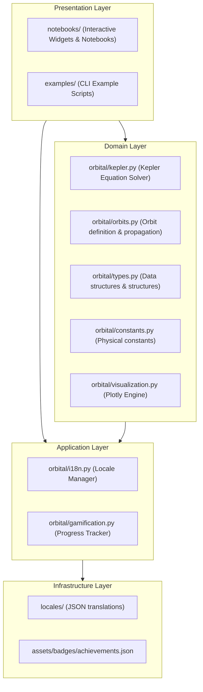

# System Architecture Document: gnss-orbital-py

This document describes the software architecture, design patterns, and engineering choices implemented in the `gnss-orbital-py` Keplerian orbital mechanics package.

---

## 1. Architectural Layers

The system is organized into four decoupled architectural layers, isolating the mathematical domain rules from localization, gamification, and front-end interactive elements:

---

## 2. Design Patterns Catalog

| Design Pattern | Implementation Class / File | Architectural Rationale |
|----------------|-----------------------------|-------------------------|
| **Strategy** | `orbital/orbits.py` -> `PropagationStrategy`, `KeplerianPropagation` | Decouples orbit definition (`OrbitalPropagator`) from the numerical/analytical propagation solver. This makes it trivial to plug in perturbation models (such as J2, atmospheric drag, or numerical integration strategies) in the future without modifying client code. |
| **Template Method** | `orbital/visualization.py` -> `OrbitPlotter` | Defines the step-by-step skeleton for generating 3D Plotly graphs (Earth sphere, orbit path line, satellite diamond marker, and dark theme layout parameters). Subclasses or custom plotters can override individual steps (like styling the Earth or changing axis dimensions) while maintaining the layout structure. |
| **Observer** | `orbital/gamification.py` -> `ProgressTracker` | Notebook exercise completions emit "action events". The tracker observes these actions and evaluates unlock triggers independently, separating educational content logic from achievement storage logic. |
| **Registry** | `orbital/i18n.py` -> `Locale` | Coordinates all application localization. Instantiated lazily as singletons per language code (caching files like `es.json`, `en.json`, and `zh.json` to prevent repeated I/O) and accessed via dot-notated keys (e.g., `errors.subsurface_orbit`). |
| **Factory Method** | `orbital/orbits.py` -> `create_*_orbit()` | Simplifies orbit generation by exposing high-level factory functions (`create_leo_orbit`, `create_meo_orbit`, etc.) with pre-configured Keplerian parameters, hiding low-level details. |
| **Facade** | `orbital/__init__.py` | Provides a unified, simplified import interface to the package. Client scripts import directly from `from orbital import ...` rather than referencing sub-modules, which simplifies public APIs. |

---

## 3. Core Design Decisions

1. **English Code Identifiers with Spanish Aliases**: For maximum compatibility with international scientific communities, the core codebase uses standard English naming conventions (PEP 8 compliant, type hints, Sphinx docstrings). The package includes direct Spanish aliases (e.g., `resolver_ecuacion_kepler = solve_kepler_equation`) to guarantee backward-compatibility for existing notebooks.
2. **Strict Emoji-Free Source Code**: Emojis are excluded from comments, docstrings, variable names, and terminal logs to maintain a clean academic style. Badges are referenced strictly by their technical IDs.
3. **No-Backend Gamification**: To keep installation simple and avoid database overhead, student achievements are stored locally in the home folder (`~/.gnss-orbital/progress.json`).
4. **Graceful Dependency Fallback**: Astrodynamics dependencies like `poliastro` and `astropy` are marked optional. The package provides its own complete Keplerian mathematical solver so that students can run orbits out-of-the-box without complex compiled installations.
