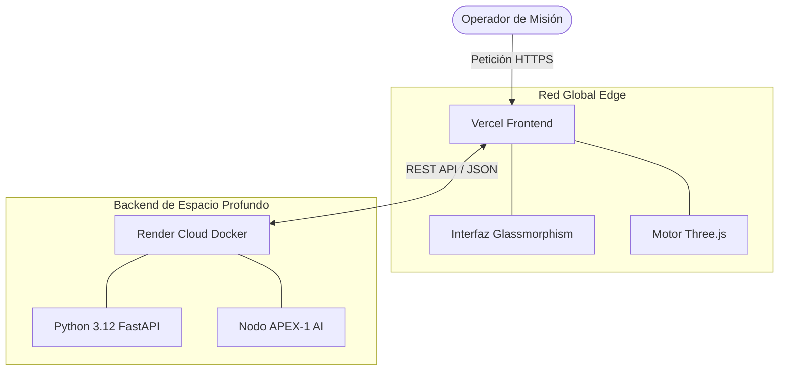

<div align="center">
  

  <h1>🌌 APEX-1 : Dinámica Orbital & IA Espacial </h1>

  **Arquitectura Multi-Agente de Próxima Generación para Control de Misiones Satelitales**

  [](LICENSE)
  [](https://python.org)
  [](https://fastapi.tiangolo.com/)
  [](https://threejs.org/)

  **Construido por [Lattice Startup](https://lattices.cl) | Arquitecto: [delnr91](https://www.linkedin.com/in/delnr91)**

  🌍 **Idiomas:** [🇬🇧 English](README.md) | [Español (Activo)](#) | [🇨🇳 中文](README.zh.md)

</div>

---

## 🚀 Resumen de la Misión

**APEX-1** es una suite de software de astrodinámica de código abierto y alto rendimiento, diseñada para la era moderna de la exploración espacial. Creada en la intersección de la mecánica orbital y la inteligencia artificial, APEX-1 integra a la perfección un **Backend matemático en Python (FastAPI)** con un **Frontend WebGL ultra-rápido** diseñado con un estilo avanzado de glassmorphism.

Ya sea simulando la constelación híbrida europea IRIS², analizando el decaimiento orbital, o comandando al Agente de IA Espacial para resolver la Ecuación de Kepler, APEX-1 provee una consola de operaciones unificada de latencia cero.

---

## 🛰️ Capacidades Principales

| Módulo | Descripción | Tecnología |
| :--- | :--- | :--- |
| **Simulador 3D Interactivo** | Renderizado en tiempo real (WebGL) de Órbitas Terrestres Bajas (LEO), Medias (MEO), Geoestacionarias (GEO) y Altamente Elípticas (HEO). | Three.js, Canvas API |
| **Agente Espacial Conversacional** | Interfaz holográfica con visualizador dinámico de frecuencias. Implementa un sistema de enrutamiento multi-agente para consultas orbitales tácticas. | Vercel Edge, OpenAI Ready |
| **Consola de Investigación Jupyter** | Integración en vivo con Jupyter Lab utilizando el método numérico de Newton-Raphson y widgets interactivos de Python. | Jupyter, Plotly, NumPy |
| **Arquitectura Multi-Agente** | Basado en el patrón de diseño Constructor/Operador, separando la planificación de misiones de la ejecución telemétrica. | FastAPI, AsyncIO |

---

## 🏗️ Arquitectura de Despliegue

APEX-1 utiliza una arquitectura de microservicios desacoplada diseñada para escalabilidad extrema y entrega global:



* **Frontend:** Desplegado en **Vercel** para entrega de contenido global en milisegundos.
* **Backend:** Contenerizado con Docker y operando 24/7 en **Render**.

---

## 🔧 Instalación y Configuración

1. **Clonar el repositorio:**
   ```bash
   git clone https://github.com/Delnr91/gnss-orbital.git
   cd gnss-orbital
   ```

2. **Iniciar la Consola de Investigación Local (Jupyter Lab):**
   ```bash
   jupyter lab --no-browser --NotebookApp.token=''
   ```

3. **Desplegar el Frontend Localmente:**
   Usa cualquier servidor web local para lanzar la carpeta `frontend/` (ej. Live Server o `python -m http.server 3000`).

---

## 💡 Apoya la Innovación Aeroespacial

APEX-1 es 100% de código abierto y depende del apoyo de la comunidad para mantener los servidores de IA en línea. Si este proyecto ha ayudado en tu investigación o estudios académicos, considera financiar la misión:

### 🪙 Binance USDT (Red: TRC20)
Haz doble clic en la dirección para copiarla al instante:
```text
TQs4zW7dCTCmCPWG7TYCUAbtag9kphR4AG
```
*(O escanea el código QR inferior con tu aplicación móvil de Binance)*


---
<div align="center">
  <i>"Ad Astra per Aspera"</i><br>
  <b>MIT License. Copyright (c) 2026.</b>
</div>
