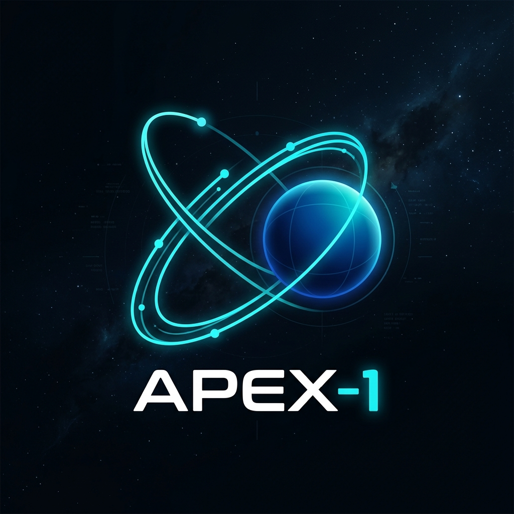
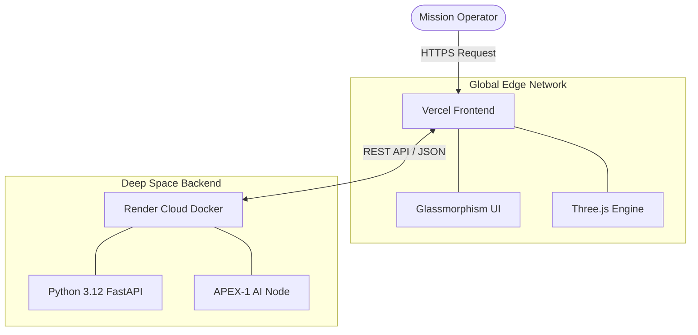

<div align="center">
  

  <h1>🌌 APEX-1 : Orbital Dynamics & Space AI </h1>

  **Next-Generation Multi-Agent Architecture for Satellite Mission Control**

  [](LICENSE)
  [](https://python.org)
  [](https://fastapi.tiangolo.com/)
  [](https://threejs.org/)

  **Built by [Lattice Startup](https://lattices.cl) | Architect: [delnr91](https://www.linkedin.com/in/delnr91)**

  🌍 **Languages:** [English (Active)](#) | [🇪🇸 Español](README.es.md) | [🇨🇳 中文](README.zh.md)

</div>

---

## 🚀 Mission Overview

**APEX-1** is a high-performance, open-source astrodynamics software suite designed for the modern era of space exploration. Engineered at the intersection of orbital mechanics and artificial intelligence, APEX-1 seamlessly integrates a **Python (FastAPI) mathematical backend** with a **highly responsive WebGL frontend** styled with advanced glassmorphism.

Whether you are simulating the IRIS² European hybrid constellation, analyzing orbital decay, or commanding the Space AI Agent to solve Kepler's Equation, APEX-1 provides a unified, zero-latency operations deck.

---

## 🛰️ Core Capabilities

| Module | Description | Tech Stack |
| :--- | :--- | :--- |
| **Interactive 3D Simulator** | Real-time WebGL rendering of Low Earth Orbit (LEO), Medium Earth Orbit (MEO), Geostationary (GEO), and Highly Elliptical Orbits (HEO). | Three.js, Canvas API |
| **Conversational Space Agent** | Holographic UI with a dynamic frequency visualizer. Implements a multi-agent routing system for tactical orbital queries. | Vercel Edge, OpenAI Ready |
| **Jupyter Research Deck** | Live Jupyter Lab integration utilizing Newton-Raphson solvers and interactive Python widgets for advanced parameter manipulation. | Jupyter, Plotly, NumPy |
| **Agent-First Architecture** | Built on a Builder/Operator multi-agent design pattern, separating mission planning from telemetry execution. | FastAPI, AsyncIO |

---

## 🏗️ Deployment Architecture

APEX-1 leverages a decoupled microservices architecture designed for extreme scalability and planetary-scale edge delivery:



* **Frontend:** Deployed on **Vercel** for millisecond global edge delivery.
* **Backend:** Containerized via Docker and served 24/7 on **Render**.

---

## 🔧 Installation & Setup

1. **Clone the repository:**
   ```bash
   git clone https://github.com/Delnr91/gnss-orbital.git
   cd gnss-orbital
   ```

2. **Start the local Research Deck (Jupyter Lab):**
   ```bash
   jupyter lab --no-browser --NotebookApp.token=''
   ```

3. **Deploy the Frontend Locally:**
   Use any local web server to serve the `frontend/` directory (e.g., Live Server or `python -m http.server 3000`).

---

## 🤝 Contributing

We welcome contributions from astrodynamicists, frontend developers, and AI engineers! 
1. Fork the Project
2. Create your Feature Branch (`git checkout -b feature/AmazingFeature`)
3. Commit your Changes (`git commit -m 'Add some AmazingFeature'`)
4. Push to the Branch (`git push origin feature/AmazingFeature`)
5. Open a Pull Request

---

## 💡 Support Aerospace Innovation

APEX-1 is 100% open-source and relies on community support to keep the backend AI servers running. If this project assisted your research or academic studies, consider fueling the mission:

### 🪙 Binance USDT (Network: TRC20)
Double-click the address below to copy instantly:
```text
TQs4zW7dCTCmCPWG7TYCUAbtag9kphR4AG
```
*(Or scan the QR code below using your Binance mobile app)*


---
<div align="center">
  <i>"Ad Astra per Aspera"</i><br>
  <b>MIT License. Copyright (c) 2026.</b>
</div>
