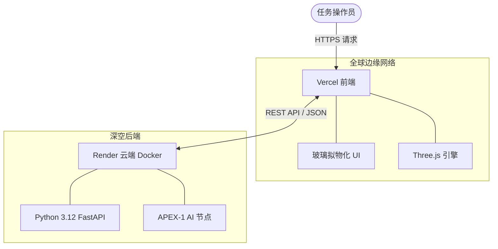

<div align="center">
  

  <h1>🌌 APEX-1 : 轨道动力学与太空人工智能 </h1>

  **面向卫星任务控制的下一代多智能体架构**

  [](LICENSE)
  [](https://python.org)
  [](https://fastapi.tiangolo.com/)
  [](https://threejs.org/)

  **由 [Lattice Startup](https://lattices.cl) 构建 | 架构师: [delnr91](https://www.linkedin.com/in/delnr91)**

  🌍 **语言:** [🇬🇧 English](README.md) | [🇪🇸 Español](README.es.md) | [中文 (当前)](#)

</div>

---

## 🚀 任务概述

**APEX-1** 是一款专为现代太空探索时代设计的高性能、开源天体动力学软件套件。APEX-1 在轨道力学和人工智能的交叉点进行工程设计，无缝集成 **Python (FastAPI) 数学后端** 与具有高级毛玻璃（Glassmorphism）风格的 **高响应性 WebGL 前端**。

无论是模拟 IRIS² 欧洲混合星座、分析轨道衰减，还是命令太空人工智能体求解开普勒方程，APEX-1 都能提供统一的零延迟操作平台。

---

## 🛰️ 核心能力

| 模块 | 描述 | 技术栈 |
| :--- | :--- | :--- |
| **交互式 3D 模拟器** | 实时 WebGL 渲染近地轨道 (LEO)、中地球轨道 (MEO)、地球同步轨道 (GEO) 和大椭圆轨道 (HEO)。 | Three.js, Canvas API |
| **对话式太空智能体** | 带有动态频率可视化器的全息用户界面。实现用于战术轨道查询的多智能体路由系统。 | Vercel Edge, OpenAI Ready |
| **Jupyter 研究控制台** | 使用 Newton-Raphson 求解器和交互式 Python 小部件进行高级参数操作的实时 Jupyter Lab 集成。 | Jupyter, Plotly, NumPy |
| **智能体优先架构** | 基于构建者/操作者多智能体设计模式构建，将任务规划与遥测执行分离。 | FastAPI, AsyncIO |

---

## 🏗️ 部署架构

APEX-1 采用解耦的微服务架构，专为极端可扩展性和全球边缘交付而设计：



* **前端 (Frontend):** 部署在 **Vercel** 上，实现毫秒级全球边缘内容交付。
* **后端 (Backend):** 通过 Docker 容器化并在 **Render** 上提供 24/7 全天候服务。

---

## 🔧 安装与设置

1. **克隆仓库:**
   ```bash
   git clone https://github.com/Delnr91/gnss-orbital.git
   cd gnss-orbital
   ```

2. **启动本地研究控制台 (Jupyter Lab):**
   ```bash
   jupyter lab --no-browser --NotebookApp.token=''
   ```

3. **在本地部署前端:**
   使用任何本地 Web 服务器来提供 `frontend/` 目录（例如，Live Server 或 `python -m http.server 3000`）。

---

## 💡 支持航空航天创新

APEX-1 100% 开源，并依靠社区支持来维持后端人工智能服务器的运行。如果该项目对您的研究或学术研究有帮助，请考虑资助这项任务：

### 🪙 Binance USDT (网络: TRC20)
双击下方地址即可瞬间复制：
```text
TQs4zW7dCTCmCPWG7TYCUAbtag9kphR4AG
```
*(或者使用您的币安移动应用扫描下方二维码)*


---
<div align="center">
  <i>"Ad Astra per Aspera"</i><br>
  <b>MIT License. Copyright (c) 2026.</b>
</div>
